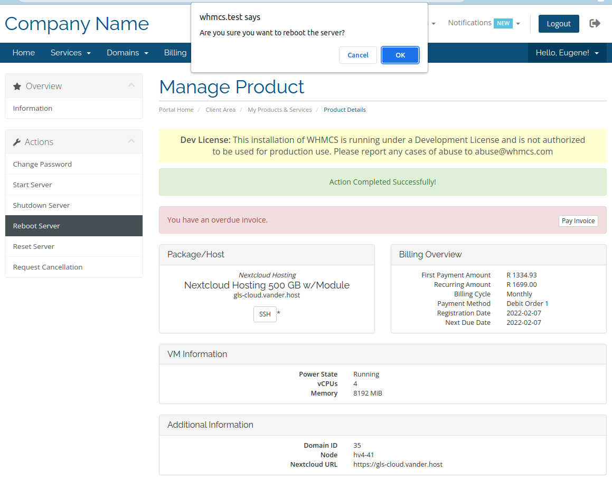

# Libvirt module for WHMCS

An open source module to interface with a libvirt system using the WHMCS hosting billing solution

* https://developer.ibm.com/tutorials/l-libvirt/
* https://www.whmcs.com/

## Features

### WHMCS Addon Module

- Display libvirt nodes and guests
- Display number of vCPUs and RAM in use by all domains
- Display the total number of vCPUs and RAM commissioned on the nodes
- Button to fetch nodes and domains based on libvirst server defined in WHMCSnodes

### Client Area Features

- View amount of vCPUs and RAM
- Start Server
- Shutdown Server
- Reboot Server
- Reset Server

### Other Features

- Easy update script
- Hyperlink to Google's Chrome SSH clients

## Installation

* We highly recommend using a VPN to connect to Libvirt nodes so that they are not publically accessible
* Add your WHMCS server's public key to the Libvirt nodes
* Copies all the files under /whmcs_installation/modules/
* First activate the module. This will create the database tables required by the module
* Then add Libvirt servers using WHMCS Systems Settings -> Server
* You only have have to specify the user and IP address since you've already added a key
* Go back to the module and press the 'Refresh Domains' button

## Screenshots

### Client Area - Reboot Server Confirmation

### Add on Module

## Credits

* LibreNMS kickstarted the libvirt virsh calls
* SolusVM has a great WHMCS module for virtualization which gave me lots of ideas
