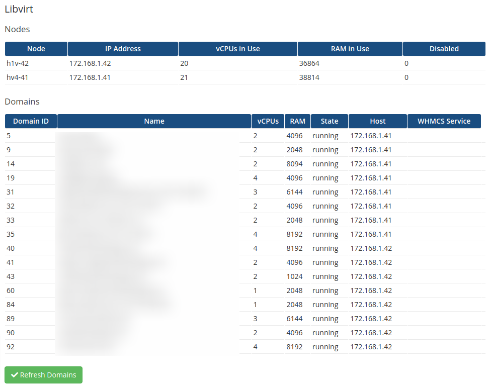

# Libvirt module for WHMCS

An open source module to interface with a libvirt system using the WHMCS hosting billing solution

* https://developer.ibm.com/tutorials/l-libvirt/
* https://www.whmcs.com/

**PRE-RELEASE SOFTWARE**

## Features

- Add on module that displays libvirt hosts and guests
- Display number of vCPUs and RAM in use by all domains
- Display the total number of vCPUs and RAM commissioned on the nodes
- Button to refresh and fetch domains from the nodes
-- This will retrieve all running domains from enabled hosts

## Installation

* Your WHMCS server's public key needs to be added to the Libvirt hosts
* First activate the module. This will create the two database tables required by the module
* Then add your Libvirt servers using WHMCS Systems Settings -> Server
** Specify the user and IP address. Since you're using keys, the password is not needed.
* Go back to the module and press the 'Refresh Domains' button

## Screenshots

### Add on Module



## VM Guest Notes

### Debian/Ubuntu

In order for the module to read the QEMU guest agent status, the following software must be installed on the guest:

`sudo apt-get install qemu-guest-agent`

Then start it:

`sudo /etc/init.d/qemu-guest-agent start`

### Developer Notes

#### Linking to WHMCS

If you have a local installed of WHMCS, e.g. in `/home/username/code/whmcs`, you can symbolically link to it so:

```bash
ln -s /home/username/code/libvirt-whmcs/addons/libvirt /home/username/code/whmcs/modules/addons/libvirt
ln -s /home/username/code/libvirt-whmcs/servers/libvirt /home/username/code/whmcs/modules/servers/libvirt
```

#### Ioncube issues

WHMCS is not PHP 8 compatile because Ioncube is not PHP 8 compatible.

Use this command to change your PHP version:

`sudo update-alternatives --config php`

If you're using Laravel Valet, you might have to also do this:

`/etc/init.d/php8.0-fpm stop`

`valet install`

## Credits

* LibreNMS kickstarted the libvirt virsh calls
* SolusVM has a great WHMCS module for virtualization
