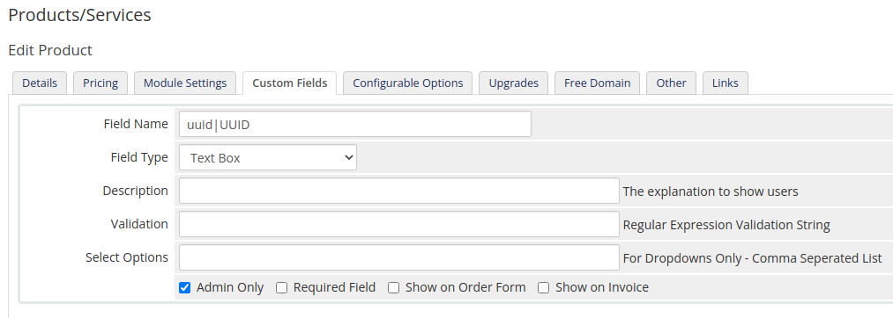
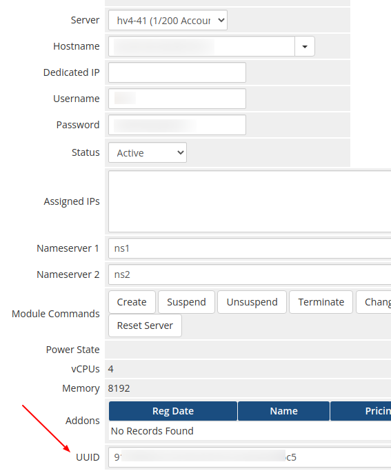

# Libvirt module for WHMCS

An open source module to interface with a [libvirt](https://libvirt.org/) system using the WHMCS hosting billing system

## Features

### WHMCS Addon Module

- Display libvirt nodes and domains
- Display the number of vCPUs and RAM in use by a domain
- Display the total number of vCPUs and RAM commissioned on the nodes
- Button to fetch nodes and domains based on libvirst server defined in WHMCSnodes

### Client Area Features

- View amount of vCPUs and RAM
- Start Server
- Shutdown Server
- Reboot Server
- Reset Server

### Admin Area Features

- Suspend Domain
- Unsuspend Domain

### Other Features

- Easy update script
- Hyperlink to Google's Chrome SSH clients

### Associating existing domains

- Please see screenshot. When creating a new product definition, add a custom field `uuid|UUID`
- Then on the service instance add the UUID
- UUIDs can be seen by going into the Add-on
 
 NOTE: When copying / pasting, remove redundant spaces

## Installation

* We highly recommend using a VPN to connect to Libvirt nodes so that they are not publically accessible
* Add your WHMCS server's public key to the Libvirt nodes
* Copies all the files under /whmcs_installation/modules/
* First activate the module. This will create the database tables required by the module
* Then add Libvirt servers using WHMCS Systems Settings -> Server
* You only have have to specify the user and IP address since you've already added a key
* Go back to the module and press the 'Refresh Domains' button

## Updating

The update script is a pretty trivial git clone command with two recursive addons and servers copies.
Once the copies are done, the current module is removed.

```
cd /home/whmcs_installation/public_html/modules/servers/libvirt/lib
sh update.sh
```

## Screenshots

### Setting up the Custom Field



### Client Area - Reboot Server Confirmation


### Add on Module


### Associating an existing domain



## Credits

* LibreNMS kickstarted the libvirt virsh calls
* SolusVM has a great WHMCS module for virtualization which gave me lots of ideas
